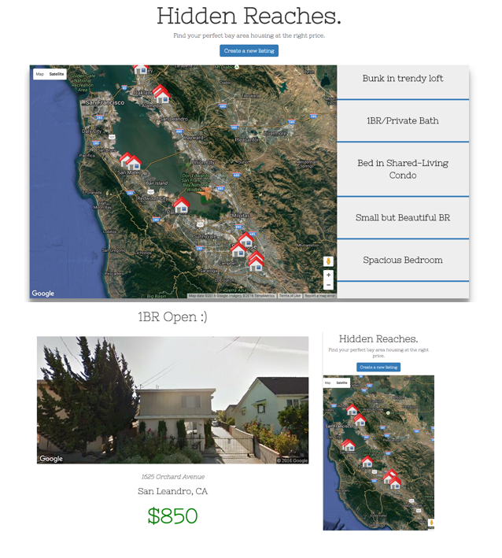

#Hidden Reaches  

<i>The Bay Area is a beautiful place, and the premiere location for those chasing their tech dreams. However the expensive costs here limit opportunity for many, who struggle to find an affordable place to live. Popular housing sites and apps are scattered, riddled with scams & unreasonable prices, as well as a confusing user experience. [Hidden Reaches](https://hidden-reaches-36395.herokuapp.com/) is here to simplify your housing needs. The simple interface makes it easy to find inexpensive rentals, or to post openings you have available.</i>

##Technologies
Hidden Reaches features a Google Maps map with house icons at each listing, as well as a listview of posts. Clicking on an icon or list item will open a modal with a Google Maps Streetview image of the post's address (for verification), details, and contact information. You can also click the button to "Create A Listing" that: must be in the Bay Area, a verified address from the Google Places Autocomplete search bar, and no more than $1200 monthly. 

####Languages
<ul>
	<li>HTML/CSS</li>
	<li>JavaScript</li>
</ul>

####Libraries/Frameworks/API
<ul>
	<li>Bootstrap/Bootstrap Validator</li>
	<li>jQuery</li>
	<li>Google API's: Maps, Streetview, Geocoding, Places</li>
</ul>

####Database/Server
<ul>
	<li>Node.js/Express</li>
	<li>MongoDB/Mongoose</li>
</ul>

##Screenshots

